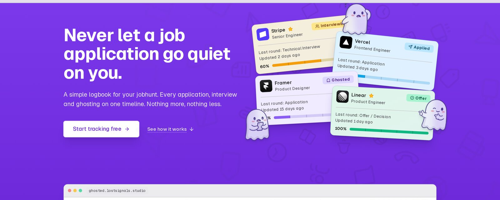
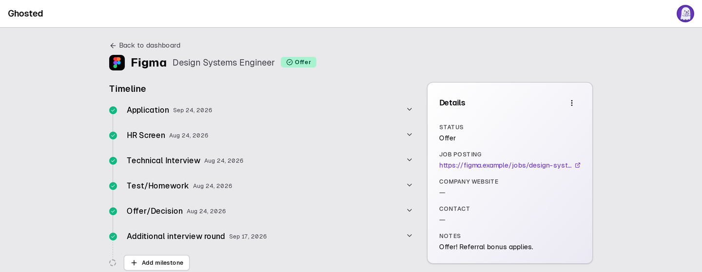

# Ghosted

[](https://github.com/krisztianhadi/ghosted/actions/workflows/ci.yml)
· MIT · Next.js 15 + React 19 · one container, one Postgres



A job-application tracker for the part of a hunt nobody tracks: the silence. Log
every application, keep its interview timeline in one place, and the ones that
stopped answering get their own section instead of slowly being forgotten.

A hosted instance runs at **[ghosted.lostsignals.studio](https://ghosted.lostsignals.studio)**,
and everything here is what runs it — the same image is the self-hosted one.

- **Ghosted is a state, not a mood.** An application that has not moved in ten
  days (configurable, per-user) leaves its column and joins the ghosted ones, so
  a stalled hunt is something you can see rather than slowly forget.
- **One timeline per application.** The five-step default extends, reorders, and
  auto-advances the status as milestones complete; rejected and offer are yours
  to set.
- **Yours to leave with.** A versioned JSON export and an import that merges into
  an existing account. A tracker you cannot leave is not one you can trust.
- **No account required to run it.** Docker Compose, your Postgres, your domain.
  Two environment flags decide whether it is a solo instance or a family one.
- **No tracking, no upsell, no AI reading your mail.** It knows only what you
  type into it, and nothing here phones home.
- **Keyboard and screen-reader honest.** The end-to-end suite runs axe on every
  page; the app is usable without a mouse and readable at 200% zoom.


## Built with AI

Ghosted is hand-written and AI-enhanced. It was built in pair-programming
sessions with **DeepSeek V4.1 Flash** running in **DeepSeek Harness**: the
architecture, design and product decisions are mine, the AI wrote and refactored
much of the code, and every change was read, tested and committed by hand. Code
that a machine wrote is still code a human is accountable for.

## Quick start

```bash
# 1. Install dependencies
pnpm install

# 2. Start Postgres and create the test database
docker compose up -d
pnpm db:create-test

# 3. Configure environment
cp .env.example .env
#    - set AUTH_SECRET (openssl rand -base64 32)
#    - optionally set TEST_DATABASE_URL

# 4. Apply migrations (dev + test databases)
pnpm db:migrate
DATABASE_URL="$TEST_DATABASE_URL" pnpm db:migrate

# 5. Run the dev server
pnpm dev            # http://localhost:3000  (JSON logs)
pnpm dev:pretty     # same, piped through pino-pretty

# 6. (Optional) seed demo data
pnpm db:seed                    # demo@example.com / password123
pnpm db:seed you@example.com    # or fill an account that already exists
```

Port 3000 taken? `pnpm dev -- --port 3100`, and point the e2e suite at it with
`NEXT_PUBLIC_APP_URL`. The full environment reference is in `.env.example` and
[docs/SETUP.md](docs/SETUP.md).

## Self-hosting

Ghosted runs as a container plus Postgres. Two shapes ship in the same image: a
solo instance (the landing page off, sign-ups closed, one account created at boot
with a password you must replace at first sign-in) and a family instance
(sign-ups open, email verification required). Everything is environment
configuration — no fork, no build flags.

```bash
cp .env.example .env   # set AUTH_SECRET, then SHOW_LANDING / ALLOW_REGISTRATION
docker compose --profile selfhost up -d
```

Email is provider-neutral: Resend, any SMTP server, or a log stub for an instance
that does not need to send at all. Migrations run at container start under an
advisory lock, and a failed migration exits the container rather than serving a
half-migrated database.

Full walkthrough, environment reference, email options, backups and upgrades:
[docs/SELFHOST.md](docs/SELFHOST.md).



## Features

- Application CRUD with a 5-step default timeline (extendable, with reordering,
  per-row menus and a progress bar)
- Milestone progress auto-advances the status: `applied -> interviewing ->
  offer`; `rejected` / `archived` / `offer` are manual terminal states
- Dashboard stats (total / active / interviewing / offers / rejected / ghosted)
- Search, status filter, sort, pagination, infinite scroll, sticky section
  headers, reversible archive, favorites pinned to the top
- Email/password auth (bcrypt) + optional Google/LinkedIn OAuth, email
  verification, password reset, GDPR export + account deletion
- Unverified accounts are limited to 3 applications until their email is
  verified (env-configurable)
- Night mode (system default + manual override), responsive UI

## Tech stack

| Layer        | Choice                                                              |
| ------------ | ------------------------------------------------------------------- |
| Framework    | Next.js 15 (App Router) + React 19                                  |
| ORM          | Drizzle + drizzle-kit (SQL migrations, no auto-sync in prod)        |
| Database     | PostgreSQL 16 (local Docker; Neon/Supabase-ready)                   |
| Auth         | Auth.js v5 (email/password + Google OAuth; LinkedIn when configured) |
| UI           | shadcn/ui-style components + Tailwind CSS                           |
| Client state | TanStack Query (caching + optimistic updates)                       |
| Validation   | Zod v4                                                              |
| Logging      | pino (structured JSON)                                              |
| Testing      | Vitest + React Testing Library + Playwright (with axe)              |

## Documentation

- [Setup & run](docs/SETUP.md) - install, env vars, commands, testing, CI/CD
- [Self-hosting](docs/SELFHOST.md) - run your own copy with Docker
- [API reference](docs/API.md) - all endpoints, parameters, examples
- [Architecture](docs/ARCHITECTURE.md) - tech stack, data flow, key decisions
- [Changelog](docs/CHANGELOG.md) - changes by date and type
- [What it costs](docs/COSTS.md) - tokens, the estimate, and the provider balance
- [Releasing](docs/RELEASING.md) - versioning, tags, publishing an image
- [Code reviews](docs/reviews/) - two independent model reviews, and the fix lists
- [Contributing](CONTRIBUTING.md) - getting it running, what gets merged
- [Security](SECURITY.md) - reporting a vulnerability, dependency triage
- [Docs index](docs/INDEX.md) - everything, in one place

## License

MIT - see [LICENSE](LICENSE).
